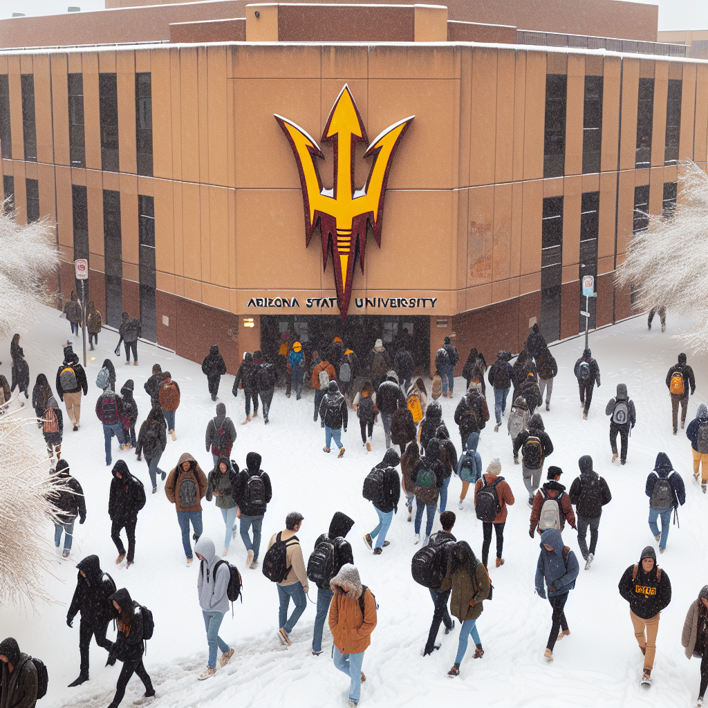
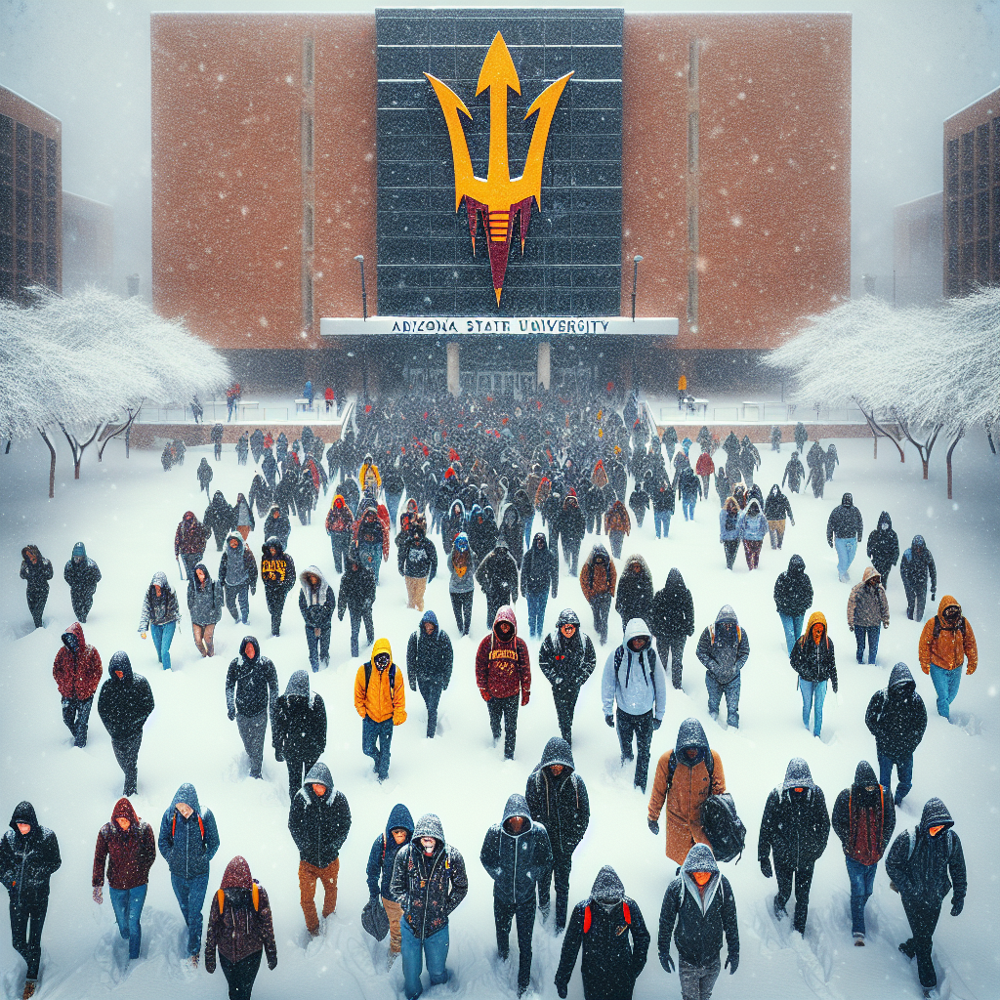
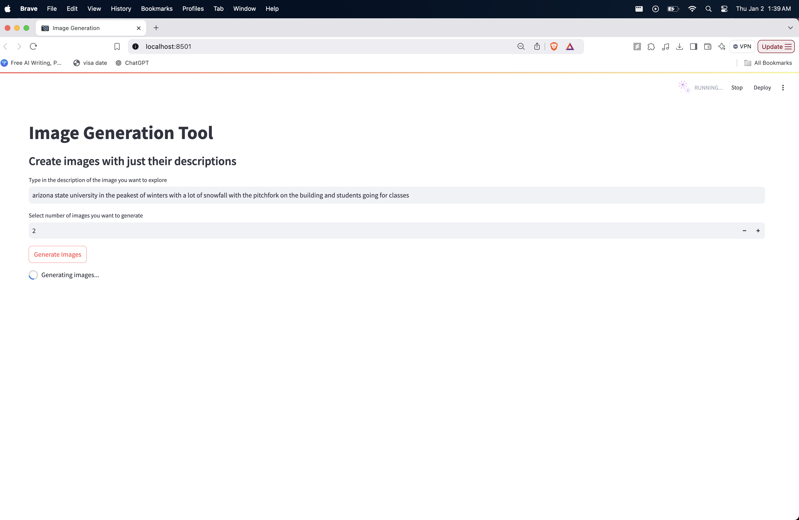

# Image Generation Tool 🖼️

## 📖 Overview

This project provides an **Image Generation Tool** that uses **OpenAI's DALL-E 3 model** to create images based on text descriptions. Built with **Streamlit**, the tool allows users to input a description and generate one or more images based on that prompt. The app allows for a seamless experience where users can interact with the interface, type in their descriptions, and receive AI-generated images in real time. The core functionality of the application involves integrating the OpenAI API to generate images from the provided description and displaying the results through a simple and clean web interface.

---


## 📖 Features

- Generate high-quality images based on text prompts.
- Supports generating up to **10 images** at a time.
- Interactive and user-friendly interface built with **Streamlit**.

---

## 🚀 Getting Started

### Prerequisites

- **Python 3.8+** installed on your system.
- OpenAI API key (you can obtain it from [OpenAI's platform](https://platform.openai.com/)).
- Install required Python packages by running:

  ```bash
  pip install openai streamlit

## 🖼️ Screenshots

### Working Example



### User Interface



